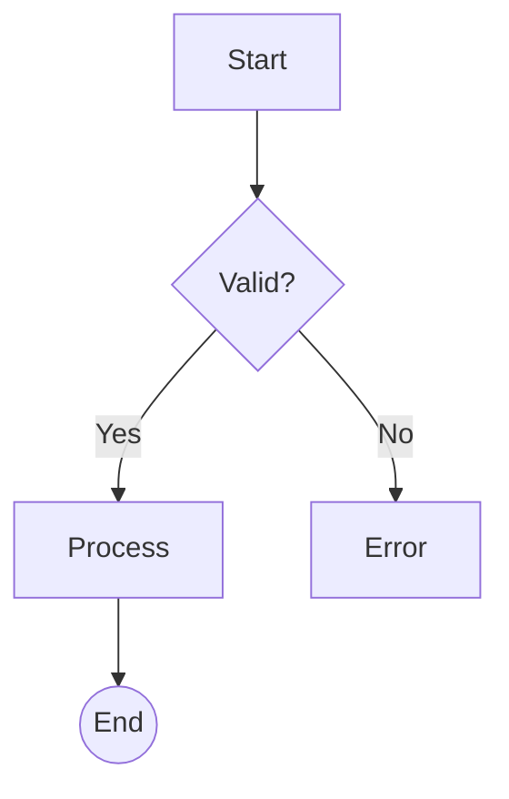

# Figma Mermaid

A FigJam plugin that converts [Mermaid](https://mermaid.js.org/) flowchart syntax into native FigJam shapes and connectors.

## What it does

Paste Mermaid flowchart syntax into the plugin and it generates an editable FigJam diagram — real shapes, real connectors, real text — not a flat image.



↓ becomes native FigJam shapes you can move, edit, and restyle.

## Features

### Flowchart Support

- **Direction** — `TD` (top-down), `LR` (left-right), `BT` (bottom-top), `RL` (right-left)
- **Connector labels** — `A -->|Yes| B` renders label text on the connector
- **Subgraphs** — `subgraph` blocks rendered as FigJam sections
- **Chained links** — `A --> B --> C` on a single line

### Label Handling

- **Line breaks** — `\n` and `<br/>` / `<br>` / `<br />` converted to newlines
- **Quoted strings** — `"text"` and `'text'` are stripped of wrapping quotes
- **Markdown strings** — `` "`**bold** _italic_`" `` parsed for formatting
- **Special characters** — Unicode, HTML entities (`#quot;`, `#9829;`), and escaped parens

### Shape Mapping

Mermaid shapes are mapped to **native FigJam shapes** wherever possible, with SVG fallback for exotic shapes.

#### Native FigJam Shapes (~25)

| Mermaid | Syntax | FigJam Shape |
|---------|--------|--------------|
| Rectangle | `[text]` | `SQUARE` |
| Rounded rectangle | `(text)` | `ROUNDED_RECTANGLE` |
| Stadium | `([text])` | `ROUNDED_RECTANGLE` |
| Diamond | `{text}` | `DIAMOND` |
| Circle | `((text))` | `ELLIPSE` |
| Double circle | `(((text)))` | `ELLIPSE` (double stroke) |
| Hexagon | `{{text}}` | `HEXAGON` |
| Subroutine | `[[text]]` | `PREDEFINED_PROCESS` |
| Cylinder | `[(text)]` | `ENG_DATABASE` |
| Horiz. cylinder | `@{ shape: das }` | `ENG_QUEUE` |
| Asymmetric | `>text]` | `ARROW_RIGHT` |
| Parallelogram R | `[/text/]` | `PARALLELOGRAM_RIGHT` |
| Parallelogram L | `[\text\]` | `PARALLELOGRAM_LEFT` |
| Trapezoid | `[/text\]` | `TRAPEZOID` |
| Triangle | `@{ shape: tri }` | `TRIANGLE_UP` |
| Flipped triangle | `@{ shape: flip-tri }` | `TRIANGLE_DOWN` |
| Multiple docs | `@{ shape: docs }` | `DOCUMENT_MULTIPLE` |
| Manual input | `@{ shape: sl-rect }` | `MANUAL_INPUT` |
| Summary | `@{ shape: cross-circ }` | `SUMMING_JUNCTION` |
| Small circle | `@{ shape: sm-circ }` | `ELLIPSE` (small) |
| Filled circle | `@{ shape: f-circ }` | `ELLIPSE` (filled) |
| Loop limit | `@{ shape: notch-pent }` | `PENTAGON` |
| Multi-process | `@{ shape: processes }` | `INTERNAL_STORAGE` |
| Text block | `@{ shape: text }` | `TextNode` |

#### SVG Fallback (~8)

Exotic shapes not available in FigJam are rendered via Mermaid's SVG renderer and imported as vector nodes:

`fork` · `notch-rect` · `tag-rect` · `bow-rect` · `div-rect` · `lin-rect` · `lin-cyl` · `lin-doc` · `curv-trap` · `flag`

### Connectors

| Mermaid | Syntax | FigJam |
|---------|--------|--------|
| Arrow | `-->` | Connector with arrow |
| Open link | `---` | Connector without arrow |
| Dotted | `-.->` | Dashed connector with arrow |
| Thick | `==>` | Thick connector with arrow |
| With label | `-->\|text\|` | Connector with text label |

## Architecture

The plugin uses a **hybrid rendering approach**:

1. **Mermaid.js runs in the plugin UI iframe** — parses the syntax and computes the layout (node positions, sizes, connections)
2. **Common shapes** → created as native FigJam `ShapeWithTextNode` objects (editable, styleable, connectable)
3. **Exotic shapes** → rendered as SVG by Mermaid, imported via `figma.createNodeFromSvg()`
4. **Connectors** → native FigJam `ConnectorNode` objects with labels, attached to shapes

```
┌─────────────────────────────────┐
│  UI Iframe                      │
│  ┌───────────┐  ┌────────────┐  │
│  │ Text input│  │ Mermaid.js │  │
│  │ (mermaid  │→ │ parse +    │  │
│  │  syntax)  │  │ layout     │  │
│  └───────────┘  └─────┬──────┘  │
│                       │         │
│              postMessage         │
└───────────────────────┼─────────┘
                        ↓
┌───────────────────────┴─────────┐
│  Plugin Sandbox                 │
│                                 │
│  • Create ShapeWithTextNode     │
│    for native shapes            │
│  • createNodeFromSvg() for      │
│    exotic shapes                │
│  • Create ConnectorNode         │
│    between shapes               │
│  • Apply layout positions       │
└─────────────────────────────────┘
```

## Development

### Prerequisites

- [Node.js](https://nodejs.org/) >= 18
- [Figma Desktop App](https://www.figma.com/downloads/)

### Setup

```bash
npm install
npm run build
```

### Load in Figma

1. Open a FigJam file in the Figma desktop app
2. Go to **Plugins** → **Development** → **Import plugin from manifest...**
3. Select the `manifest.json` from this project

### Development Mode

```bash
npm run watch
```

Edit code → save → re-run the plugin in FigJam to see changes.

## Project Structure

```
figma-mermaid/
├── manifest.json          # Figma plugin manifest
├── package.json
├── tsconfig.json
├── src/
│   ├── code.ts            # Plugin sandbox (FigJam API)
│   ├── ui.ts              # UI iframe logic (Mermaid parsing)
│   ├── ui.html            # Plugin UI
│   ├── shapes.ts          # Mermaid → FigJam shape mapping
│   ├── connectors.ts      # Connector creation + labels
│   ├── layout.ts          # Position nodes from Mermaid layout
│   └── labels.ts          # Label parsing (quotes, \n, <br/>, markdown)
├── README.md
└── LICENSE
```

## License

MIT
